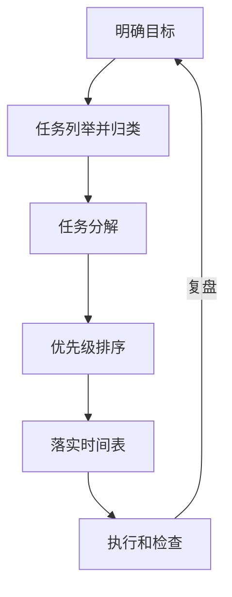
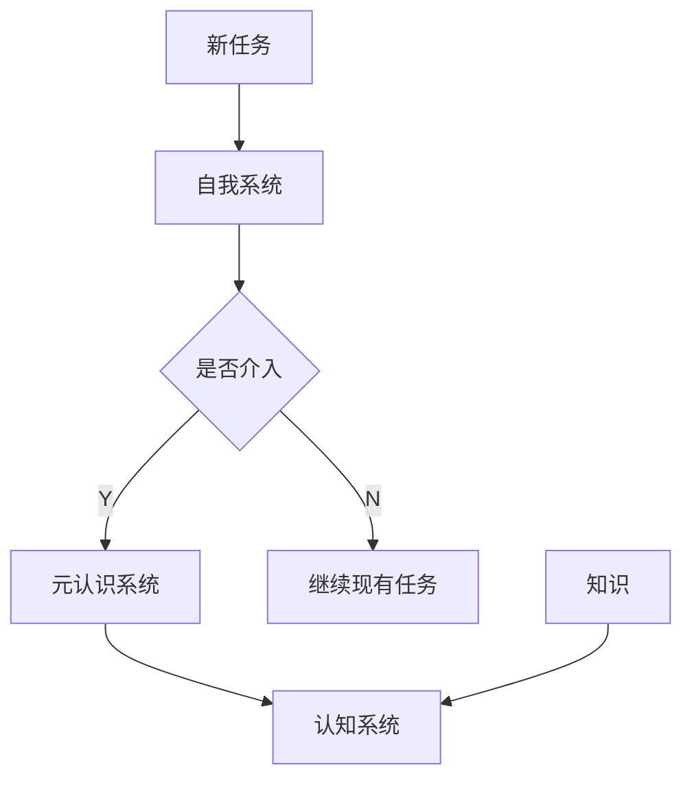

## 书

---

| 书名 | 别说你懂思维导图 |
| --- | --- |
| 作者 | 赵国庆 |
| 豆瓣评分 | 6.7 |
| 分类 | 思维 |
| In 豆瓣 | [别说你懂思维导图](https://book.douban.com/subject/26372189/) |
| 读书方法 | 快速阅读 |
| 阅读时间 | 20181120-20181121 |

<!--more-->

## 问题

- 怎样的才算思维导图？
`同时`满足：焦点集中，主干发散，层次分明，节点关联，使用不同的颜色、形状、代码
- 如何制做思维导图？
1.满足上条
2.禁忌：照搬目录，没有层次，连线没有关系，图中信息量过大，内在逻辑过大
- 软件VS手绘如何取舍？
`同时`使用

## 收获

### 概念卡

- 思维导图
放射性思维的表达，人类思维的自然功能。

| 特点 | 禁忌 |
| --- | --- |
| 焦点集中，主干发散，层次分明，节点关联，使用不同的颜色、形状、代码 | 照搬目录，没有层次，连线没有关系，图中信息量过大、逻辑缺失 |
- 常规笔记 VS 思维导图

| 常规笔记 | 思维导图 |
| --- | --- |
| 线性为主，断落式、条列式和大纲式。 | 图形、图像、颜色、线条、关联。 |
| 埋没关健字，不易记忆，浪费时间，不能刺激大脑。 | 焦点集中，主干发散，层次分明，节点相联，结构清晰。 |

- 记忆(认知心理学)

| 名称 | 特点 |
| --- | --- |
| 感觉记忆 | 瞬时记忆，容易大但记忆时间知 |
| 工作记忆 | 短时记忆，容量有限，提取效率高 |
| 长时记忆 | 对世界和自身的全部记忆，容易无限 |

**感觉记忆-->工作记忆<-->长时记忆**

- 四象限法
维度：**重要、紧急**

图片来源：[【小說商學院】時間四象限法－工作管理
](https://www.rocknovels.com/time-quadrant.html)

- 时间管理

此框架与`TEFCAS`，有很多的类似。
- In思维导图 手绘 VS 软件

|  | 手绘 | 软件 |
| --- | --- | --- |
| 优势 | 随时随地，随心所欲，发挥绘画专长 | 易学，方便个性、保存、分享 |
| 不足 | 个性、保存、分享不便 | 配图不好找，依赖电脑 |

建议：**手绘+软件 同时使用**

- 左右脑

|  | 左脑 | 右脑 |
| --- | --- | --- |
| 专注 | 语言、逻辑、数学、数字、顺序、词语 | 韵律、节奏、音乐、图画、想像、图案 |

- 人类学习模型

元认识系统：**建立目标和策略**
认知系统：**处理相关系统**

### 金句

- 对人类来说，最好的学习方式是模仿，大到治国，小到一个具体的技能，莫不如此。
- 时间管理是计划`将来`。

## 感悟

- 无论是思维管理、阅读还是工作能力提升，最终要做的事情，都把自己的积累`快速`提高，并在`合适`的时间进行利用。
- `温故而知新`，一定要温故，要不真记不住 。这不是你的错，是`人的特性`决定的。

## ToDo

- [ ] 针对有积压工作的情况下，采用`四象限` + `时间管理`，就可以很好的应对。