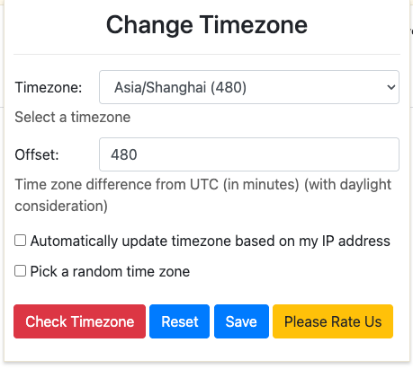

## 场景

前端页面中的显示时间，是按当前用户的时区进行转换和显示。所以如果用户在中国大陆访问一个美国网站，看到的时间会是美国时间转换为北京时间后的结果。

这样不利于查看时间进展，尤其是一些需要近期的时间节点，因为美国的时间比国内晚很多小时。

## 解决方案
Chrome插件：``Change Timezone for Google Chrome``，可以直接通过改变浏览器的时区，刷新页面即可获取当前设置的时区，而不需要调整电脑的时间。

同时也支持国际上的大部分时区，可以根据需要进行选择。

安装地址：[Change Timezone for Google Chrome - Chrome 网上应用店](https://chrome.google.com/webstore/detail/change-timezone-for-googl/fmjamjpmkcoaklkmcimlpjkeeglemae/related?hl=zh-CN)

